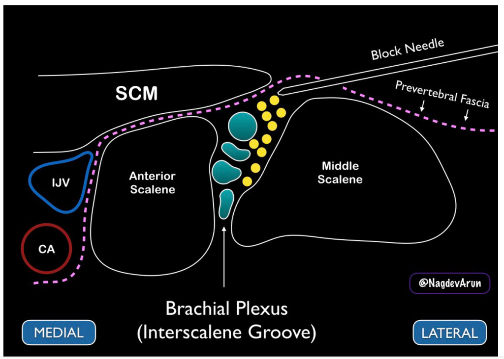

# Case 1

74 year old man with COPD and pulmonary hypertension undergoing repair of fractured left distal radius, 1st digit repair, 4th digit laceration repair.

What kind of anesthetic would you offer?  Choose the best answer(s).

* A. General Anesthesia
* B. Epidural
* C. Supraclavicular Block
* D. Interscalene Block
* E. Axillary Block

```{dropdown} Answer

__C. Supraclavicular block__

Single-shot supraclavicular block + intercostobrachial block as primary regional anesthetic.
* Primary anesthetic blocks require a higher concentration of local anesthetic.  We will use 0.25% Ropivicaine or 0.25% Bupivicaine.
* In contrast, analgesic blocks typically use 0.2% ropivicaine or 0.25% bupivicaine.
* In the OR, sedation provided over regional block for patient's comfort.

__Explanation:__

A. General Anesthesia: only if patient refuses nerve block or nerve block inadequate.  Would have to intubate patient with COPD and pulmonary hypertension which has risks involved.

B. Epidural: wrist/hand innervated by brachial plexus which is C5-T1.  We generally don't do epidurals in the cervical region because of risk of injury & epidurals cause sympathectomy + block to cardiac accelerator fibers.

__C. Supraclavicular Block:__ Best answer.  Would also need intercostobrachial to cover tourniquet over upper arm, though if surgery is <1 hour, most patients tolerate tourniquet without needing additional block.

D. Interscalene Block: Reasonable option if COPD mild, but hemidiaphragm paralysis from phrenic nerve involvement in patients with compromised ventilatory mechanics may cause significant dyspnea.  Also does not cover ulnar distribution and would not cover 4th digit.



E. Axillary Block: Reasonable option, but more difficult to perform.  If patient is anti-coagulated then this would be the best option.

```
