# Equipment

## Ultrasound

* most blocks done with linear transducer (15-6MHz)
* for kids/skinny patients, consider using small linear transducer (13-6MHz)
* Some deeper blocks require curvilinear
* phased array transducer generally not used for nerve blocks, more common for TTE

| | Small Linear | Large Linear | Hockey Stick | Curvilinear | Phased Array |
| --- | --- | --- | --- | --- | --- |
| Image | 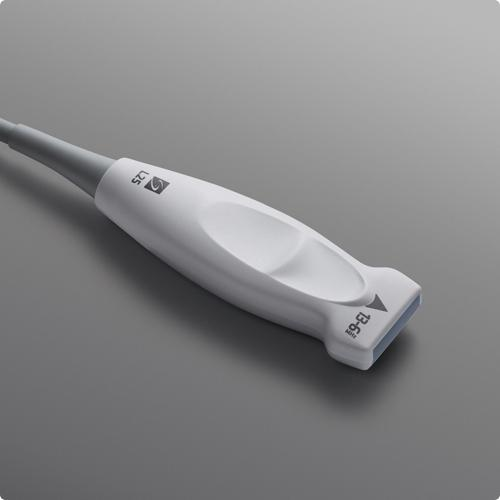 | 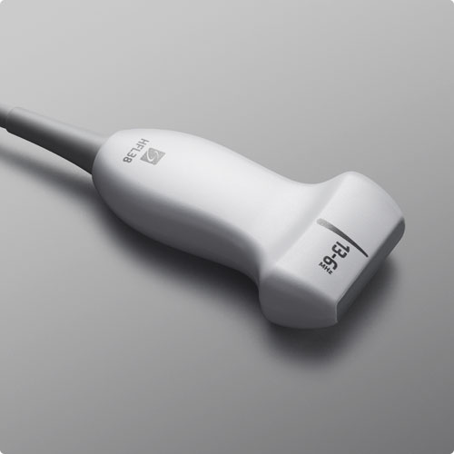 | 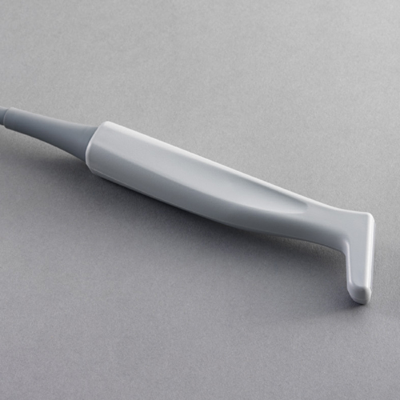 | 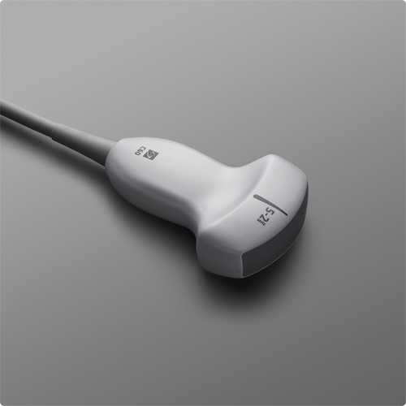 | 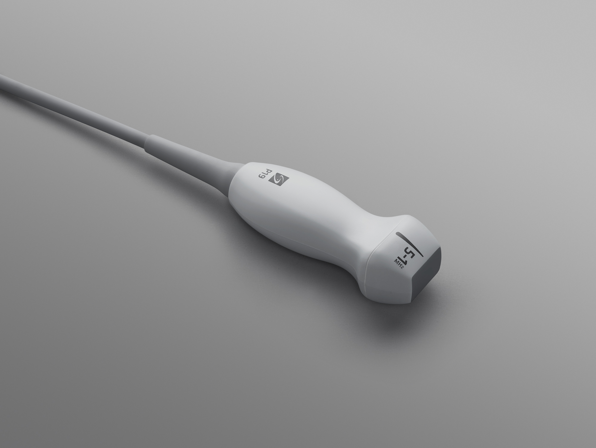 |
| Usage | Peripheral IV, Arterial Line | Nerve Block, Central Line | Same as "small linear" | Abdominal, Deep Structures | Cardiac

<https://www.sonosite.com/products/ultrasound-transducers>

### In-Plane vs. Out-of-Plane technique

* most nerve blocks done with in-plane technique
* in-plane technically more challenging to align needle tip & target, but can always visualize needle trajectory & tip

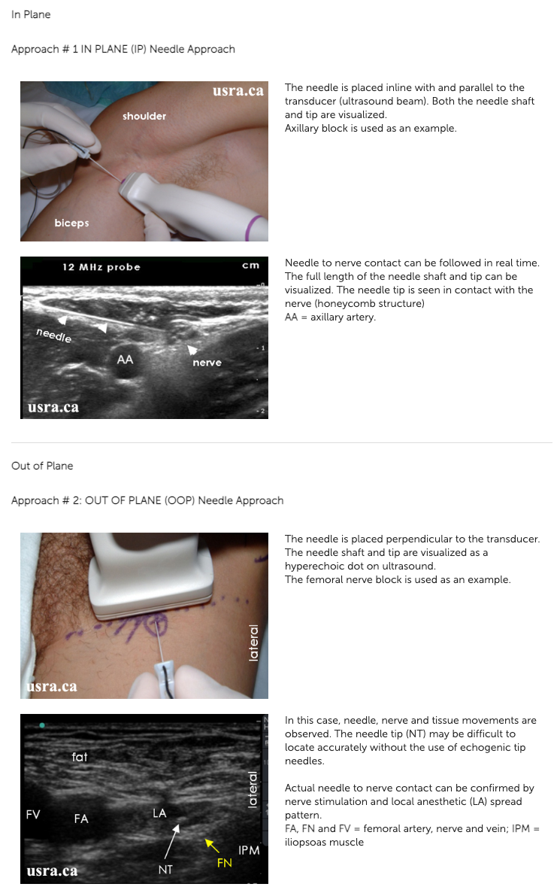

<http://www.usra.ca/regional-anesthesia/ultrasound-guided-techniques/needlingtechs.php>

## Single-Shot Block Needles

### Pajunk Sonoplex

* thin 21G needles
* short 50mm vs Long 100mm
* more echogenic, can also be used with nerve stimulator

<https://pajunkusa.com/products/regional-anesthesia/nerve-blocks/needles/sonoplex-ii/>

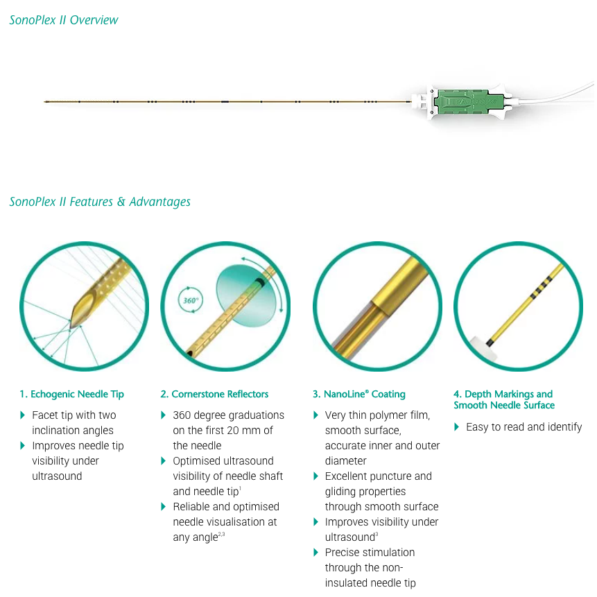

## Catheters

* more time consuming / technically complex procedure
* catheters known to migrate w/ repositioning
* catheters can leak & this is normal

### Catheter Over Needle Technique (Pajunk E-Cath)

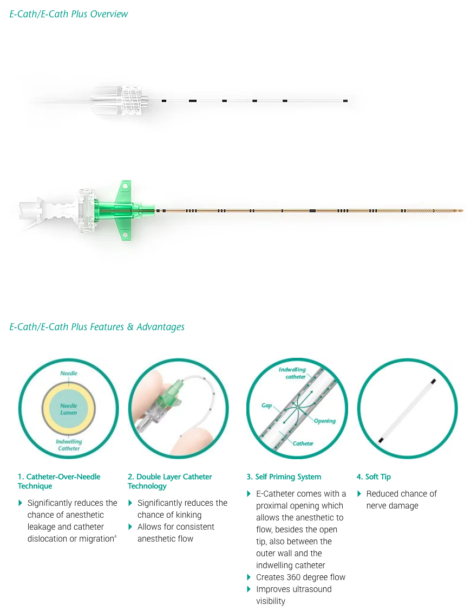

<https://pajunkusa.com/products/regional-anesthesia/nerve-blocks/catheter-sets/e-cath-e-cath-plus/>

### Catheter Through Needle (Sono-Long)

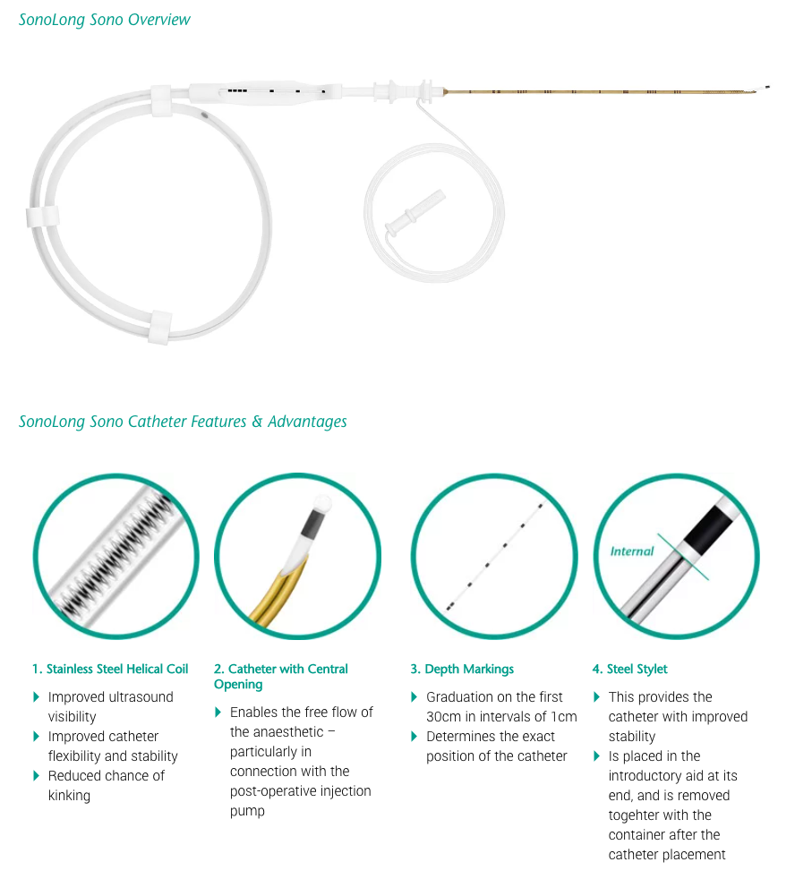

<https://pajunkusa.com/products/regional-anesthesia/nerve-blocks/catheter-sets/sonolong-sono/>

### Catheter Through Needle (Epidural)

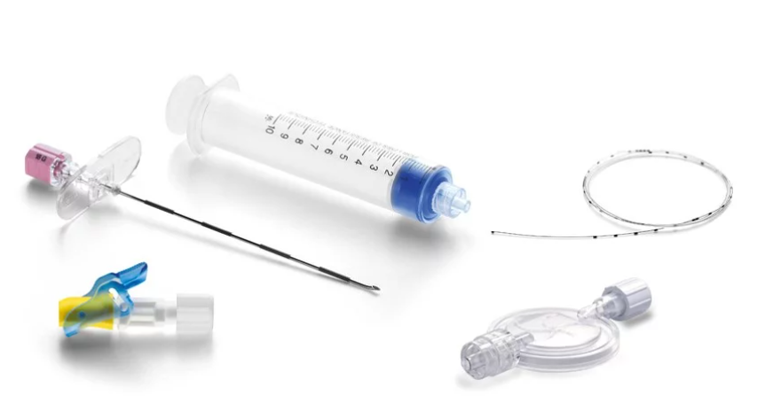

<https://pajunkusa.com/products/regional-anesthesia/epidural-caudal/catheter-sets/>

## Catheter Over Needle vs. Through Needle

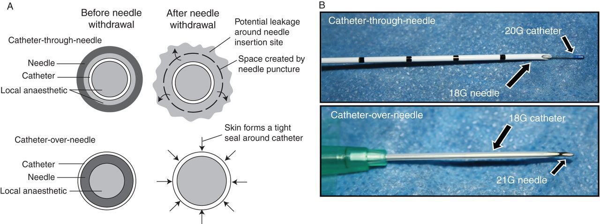

* __Catheter-over-needle:__ no gap between skin & catheter, less prone to leaking but still possible.  Can seal this with dermabond.
* __Catheter-through-needle:__ after needle withdrawn, small gap around catheter & prone to leakage.  Can seal this with dermabond.

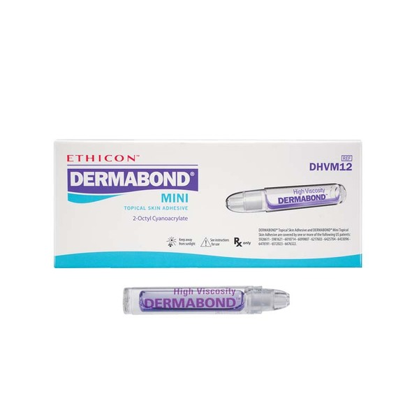

<https://www.bjanaesthesia.org.uk/article/S0007-0912%2817%2930900-5/fulltext>
