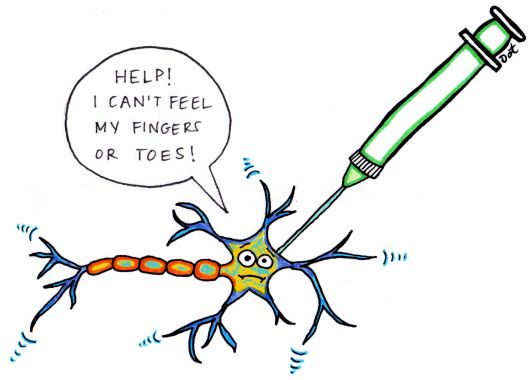

# Practical Overview of Nerve Blocks

__Philip Chung (CA-3) | 9/19/2022__



Useful for:

* APS Rotation: when you get a page overnight about a peripheral nerve catheter (PNC)
* CA-2/3 Regional Rotations
* General OR Cases: when to reach out to regional anesthesia team @ UWMC, HMC, VA to coordinate if your patient is getting blocked
* Anesthesia Exams

```{tableofcontents}
```
