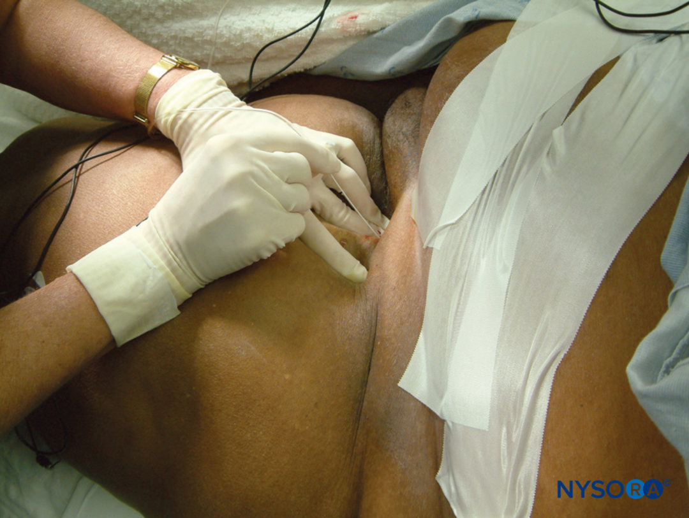
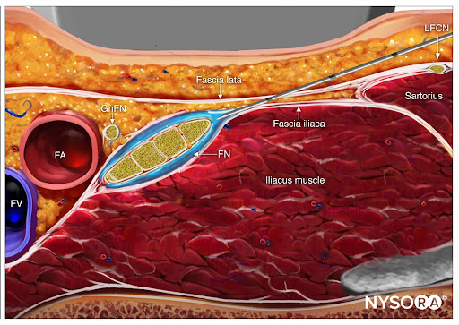
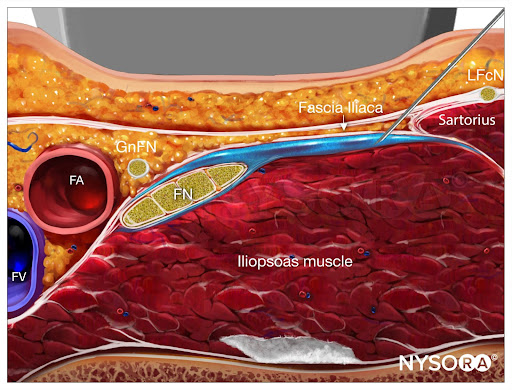
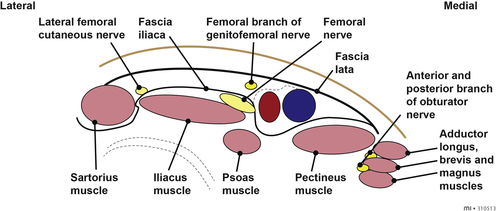
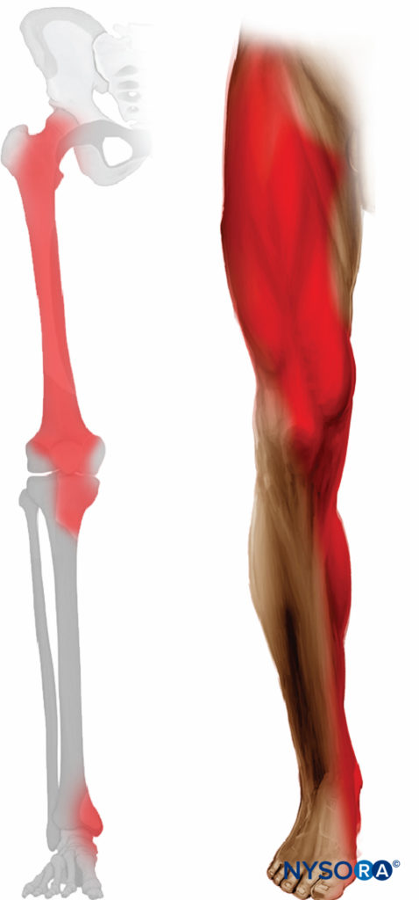

# Lower Extremity Blocks

### Popliteal Sciatic

* covers 80% circumferential around ankle (anterior, lateral, posterior)
* covers most of foot
* motor block to foot & calf
* no motor block to hamstrings (extends leg)
* thigh tourniquet usually above coverage
* positioning: elevate leg or lateral

<!-- Popliteal Sciatic Block Video -->

  

    <iframe src="https://www.youtube.com/embed/WX1hx6cUGjs" frameborder="0" allowfullscreen
      style="position:absolute;top:0;left:0;width:100%;height:100%;"></iframe>
  

Note: Sciatic Nerve block can also be done at subgluteal level (more proximal) if no access to popliteal fossa

* more challenging as sciatic nerve is much deeper (~7+ cm)
* may require curvilinear probe
* also will block hamstrings

### Saphenous (Adductor Canal)

* covers 20% medial side of ankle
* covers medial side of foot to toe
* covers part of knee
* saphenous nerve is pure sensory, no motor block

<!-- Adductor Canal Block Video -->

  

    <iframe src="https://www.youtube.com/embed/_lp1rKuqzsk" frameborder="0" allowfullscreen
      style="position:absolute;top:0;left:0;width:100%;height:100%;"></iframe>
  

### Femoral

* covers medial thigh & knee
* blocks quadricep muscles (extends knee)
* obese patients - tape pannus away from groin

<!-- Femoral Nerve Block Video -->

  

    <iframe src="https://www.youtube.com/embed/tMy978ZwaDU" frameborder="0" allowfullscreen
      style="position:absolute;top:0;left:0;width:100%;height:100%;"></iframe>
  

### Fascia Iliaca

* Fascial plane block
  * can be difficult to identify fascial plane
* Coverage:
  * femoral nerve - 100% of cases
  * lateral femoral cutaneus (LFCN) - 80-100% of cases
  * obturator nerve - sometimes
* useful for skin graft harvest site & hip surgeries
* 2 approaches:
  * Infrainguinal - similar view as femoral
  * Suprainguinal - better for getting wider spread (e.g. LFCN, obturator)

__Suprainguinal Fascia Iliaca Block:__

<!-- Suprainguinal Fascia Iliaca Block Video -->

  

    <iframe src="https://www.youtube.com/embed/F6262uoP3Nw" frameborder="0" allowfullscreen
      style="position:absolute;top:0;left:0;width:100%;height:100%;"></iframe>
  

### Sources

Most of resources/images taken from NYSORA which is a good site for learning/review.
<https://www.nysora.com/techniques/lower-extremity/>
