# Upper Extremity Blocks

Brachial Plexus & Nerve Block Locations

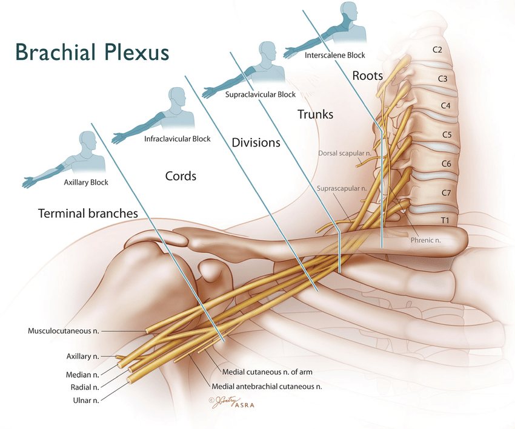

<https://aneskey.com/brachial-plexus-block/>

<https://www.researchgate.net/figure/Idealized-brachial-plexus-Various-approaches-define-individual-brachial-plexus-blocks_fig4_24197528>

## Interscalene (ISB)

* Better shoulder coverage than Supraclavicular because reliably blocks above suprascapular nerve take-off.
* Often misses ulnar distribution
* 100% chance of Phrenic Nerve (C3,4,5).  Transient Hemidiaphragmatic Paralysis.
* Difficult to place catheter.  Shallow, no muscle/ligament to anchor catheter.

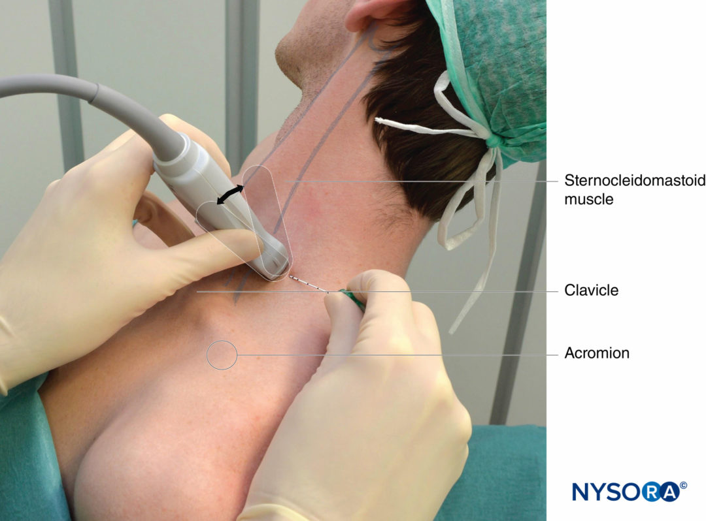

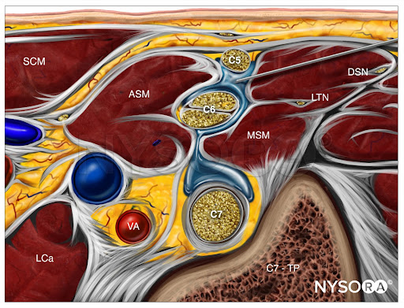

<!-- Interscalene Block Video -->

  

    <iframe src="https://www.youtube.com/embed/7DRPiS3ZrVo" frameborder="0" allowfullscreen
      style="position:absolute;top:0;left:0;width:100%;height:100%;"></iframe>
  

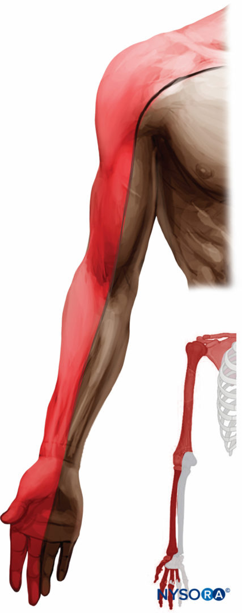

## Supraclavicular

* "Spinal of the Arm".  Commonly used for primary regional anesthetic in hand room cases.
* Low pneumothorax risk.  Needle protected by 1st rib.
* ~67% chance of Phrenic Nerve involvement
* Difficult to place catheter.  Shallow, no muscle/ligament to anchor catheter.

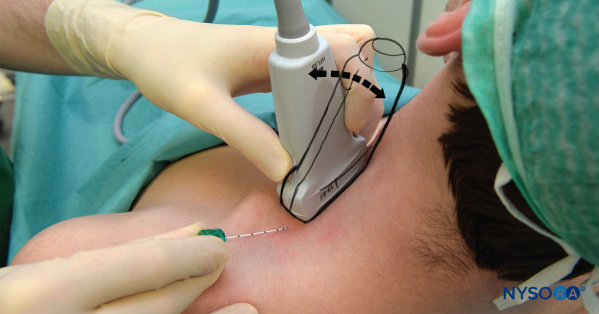

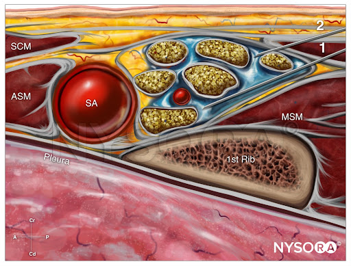

<!-- Supraclavicular Block Video -->

  

    <iframe src="https://www.youtube.com/embed/y-p9We5i23M" frameborder="0" allowfullscreen
      style="position:absolute;top:0;left:0;width:100%;height:100%;"></iframe>
  

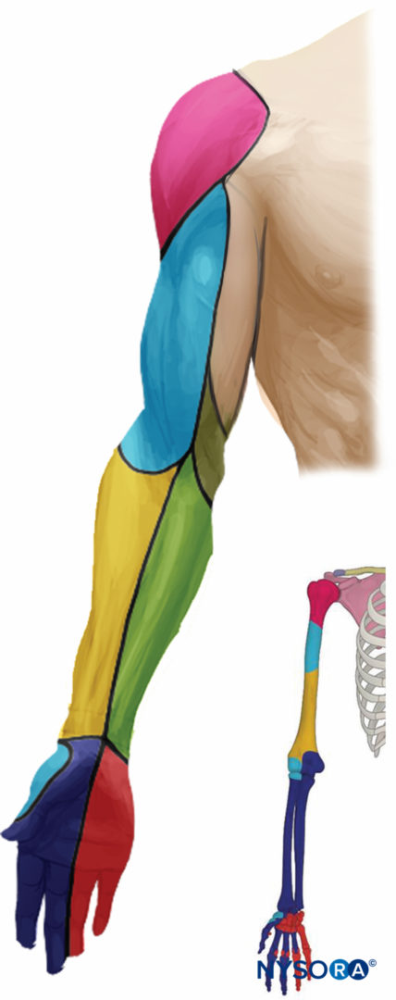

## Infraclavicular

* Similar coverage to Supraclavicular, little less reliable to get shoulder
* Better for catheters.  Pectoral muscle anchors catheter
* Deep structure, steep needle angulation, difficult needle visualization
* Higher pneumothorax risk.  No bony protection against needle.

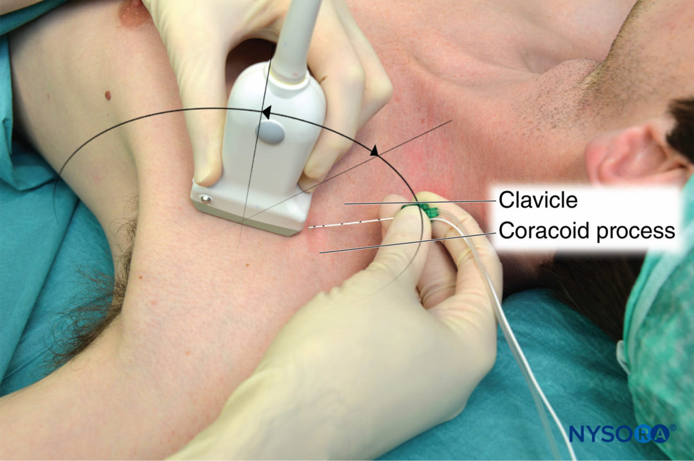

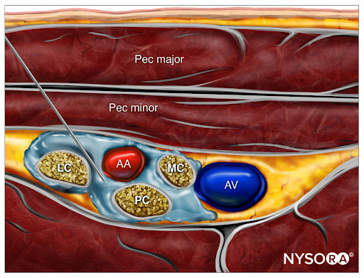

<!-- Infraclavicular Block Video -->

  

    <iframe src="https://www.youtube.com/embed/eLaz7tjPmmc" frameborder="0" allowfullscreen
      style="position:absolute;top:0;left:0;width:100%;height:100%;"></iframe>
  

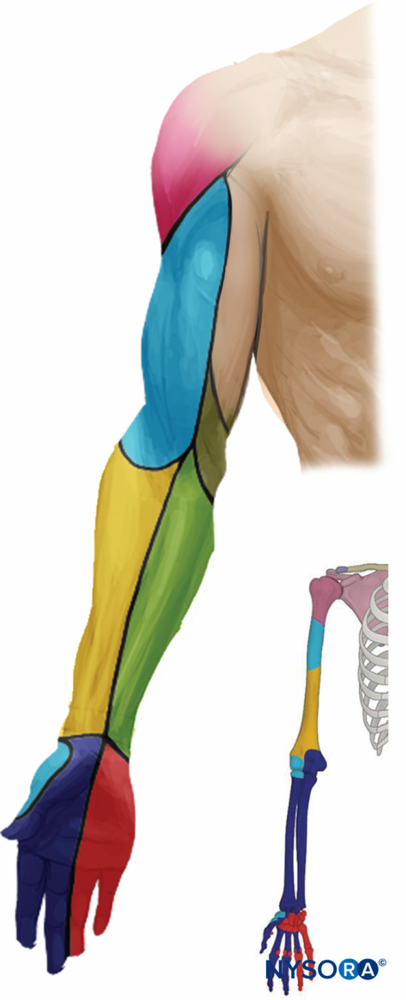

## Axillary

* Requires arm up positioning
* No shoulder coverage
* More targets.  Nerves have branched out.  Need to get around axillary artery for Radial/Ulnar/Median & separately get musculocutaneous.
* Alternative to other brachial plexus blocks for anticoagulated patients as axillary region is compressible

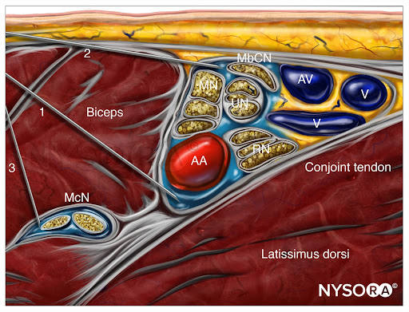

<!-- Axillary Block Video -->

  

    <iframe src="https://www.youtube.com/embed/Iega6O6IQM8" frameborder="0" allowfullscreen
      style="position:absolute;top:0;left:0;width:100%;height:100%;"></iframe>
  

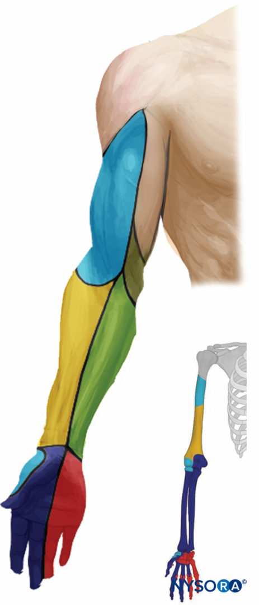

# Getting the T2 Dermatomal Distribution

## Intercostobrachial (ICB)

* Branch of T2.  Not part of brachial plexus.
* Often needed for tourniquet or AV fistula.
* Anesthetize small subcutaneous nerves

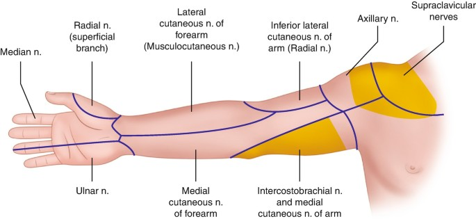

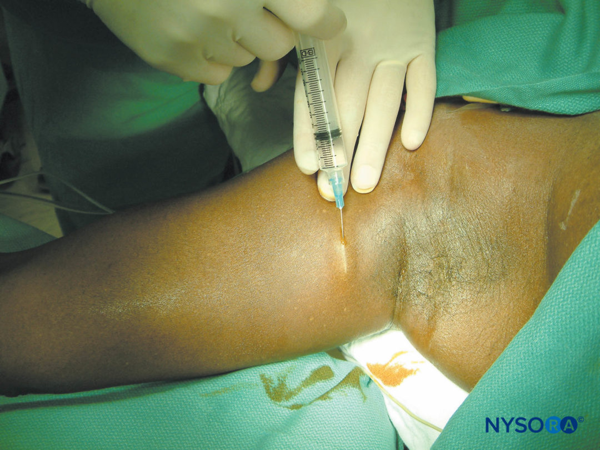

## Pectoralis (Pecs I/II)

* Fascial plane block
* Covers axillary/shoulder nerves not innervated by brachial plexus
  * Proximal inner arm (T2/intercostobrachial distribution)
  * Axilla
  * Posterior Shoulder
* Note: similar location to Serratus Anterior blocks, which is more lateral and in the axillary line

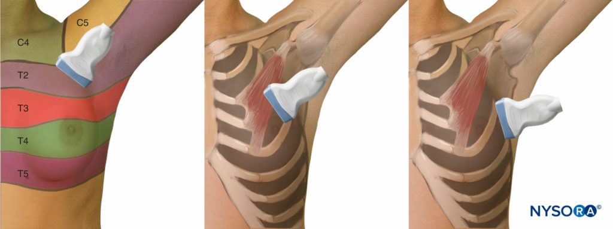

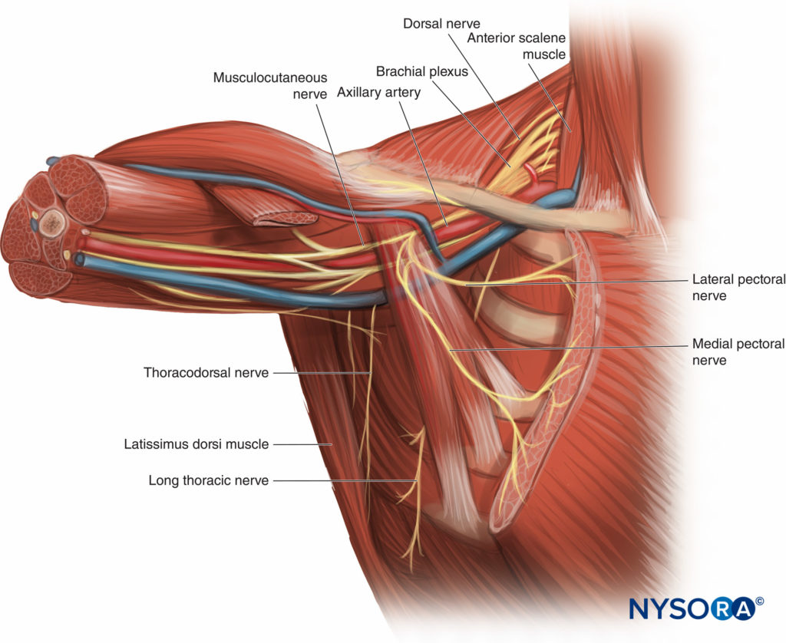

Pecs 1 & pecs 2 block injection sites.

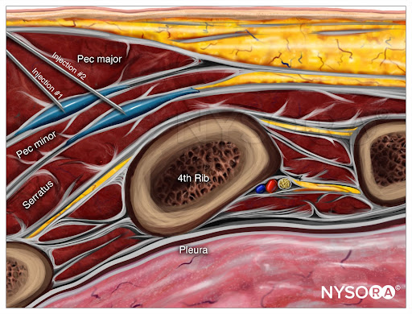

### Sources

Most of resources/images taken from NYSORA which is a good site for learning/review.
<https://www.nysora.com/techniques/upper-extremity/>
